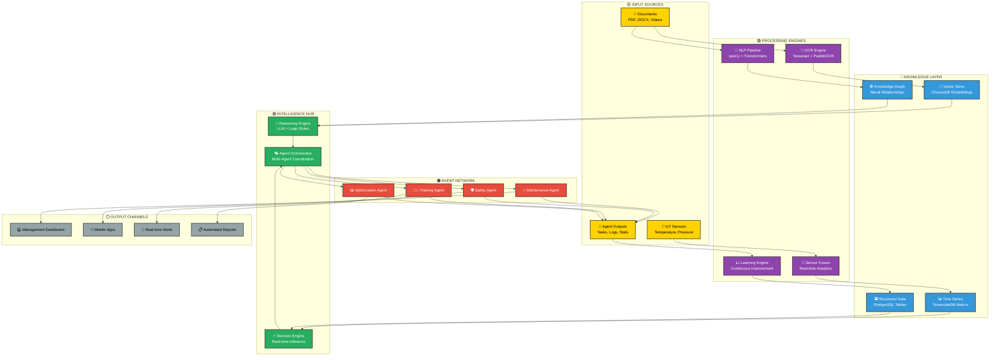
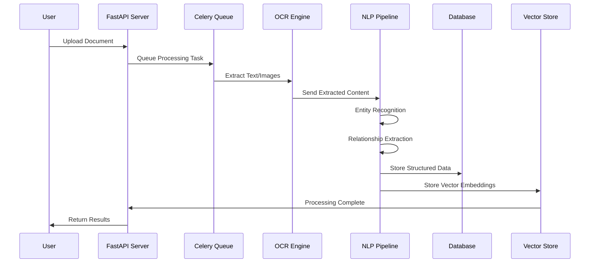
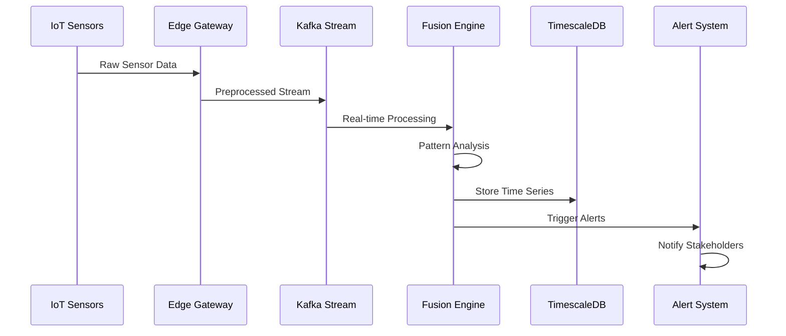
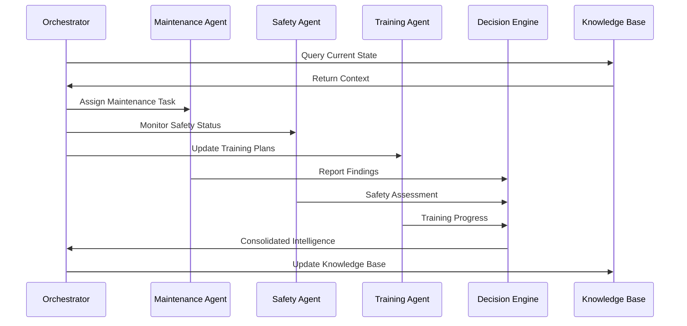
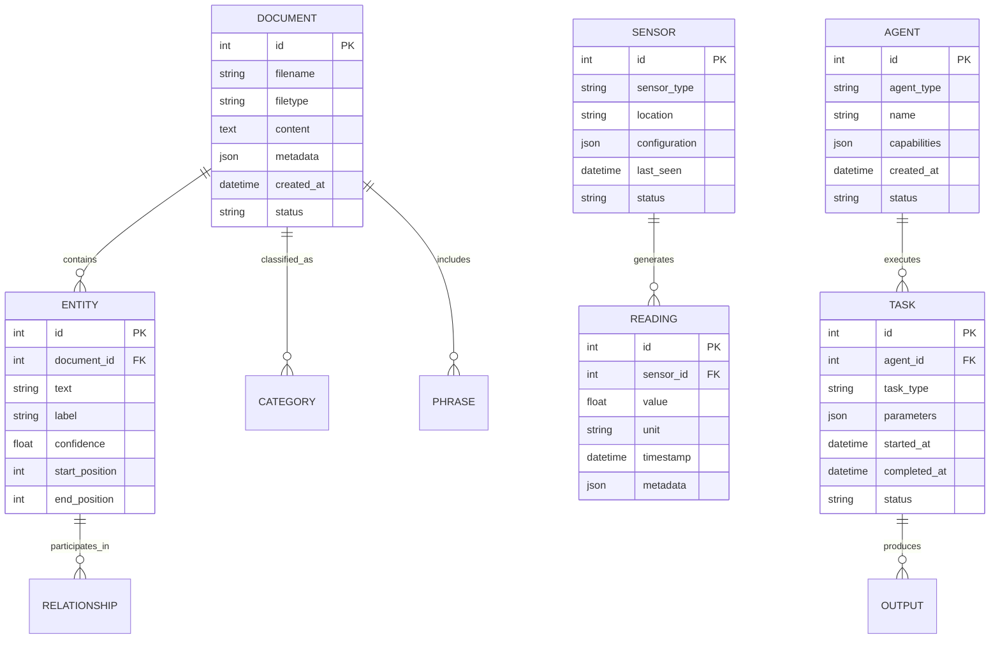
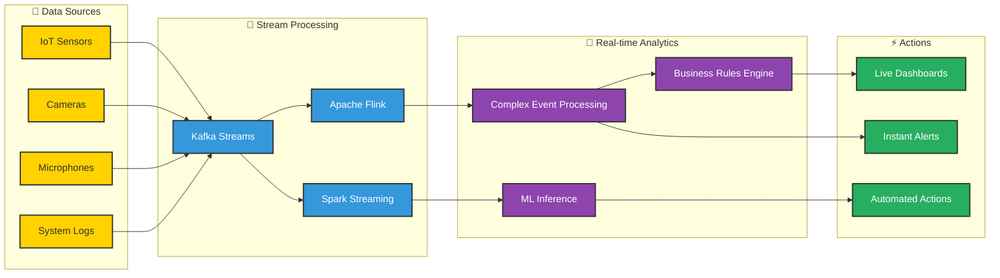
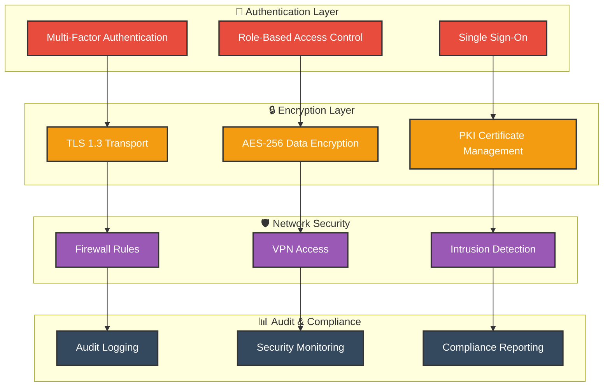

# EXPLAINIUM - Data Flow Architecture

*Professional data flow and processing pipeline documentation*

---

## 🔄 Data Flow Overview

### 📊 Complete Data Processing Pipeline

---

## 🏗️ Processing Pipeline Details

### 📄 Document Processing Pipeline

### 🔬 Sensor Data Pipeline

### 🤖 Agent Coordination Pipeline

---

## 📊 Data Models & Schemas

### 🗃️ Core Data Structures

---

## ⚡ Real-time Processing Architecture

### 🔄 Stream Processing Flow

---

## 🔒 Security & Privacy Architecture

### 🛡️ Security Layers

---

*Developed following Turku UAS visual identity standards*
*© 2024 EXPLAINIUM Project - Professional Technical Documentation*
