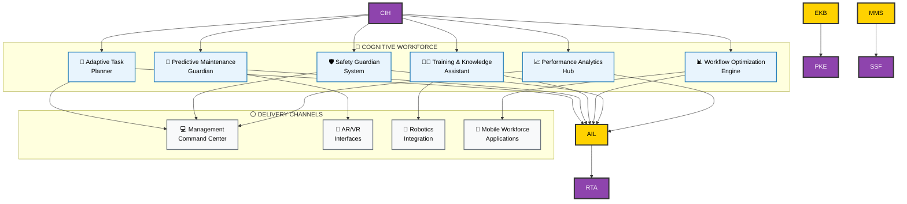
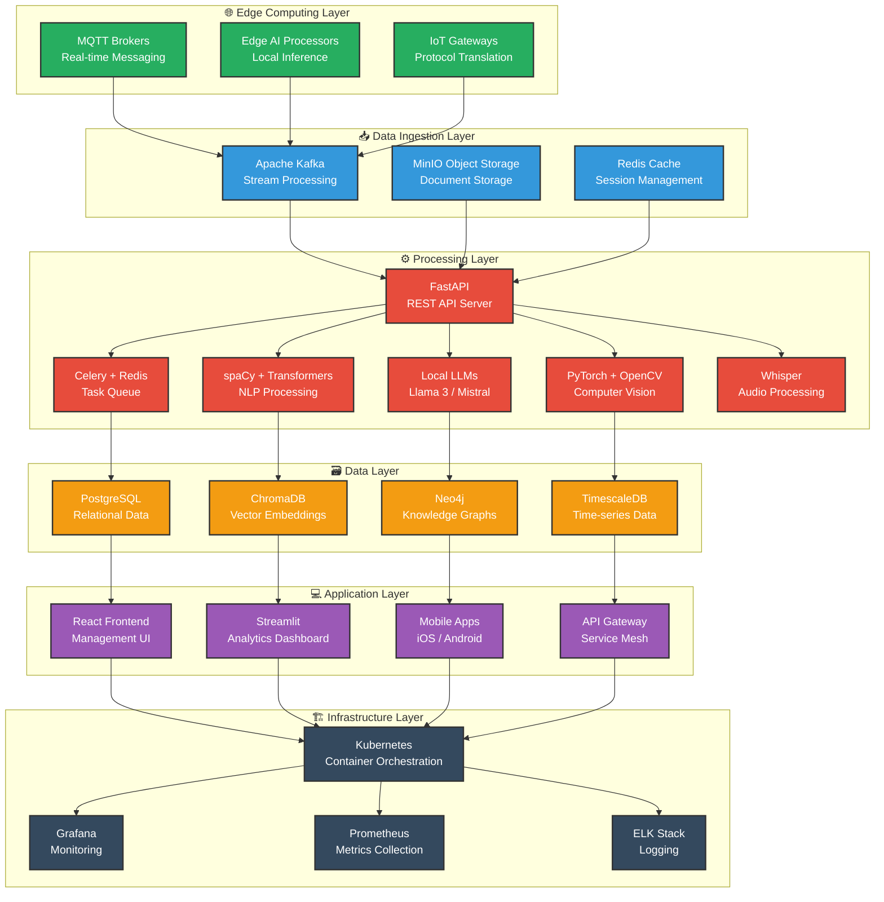
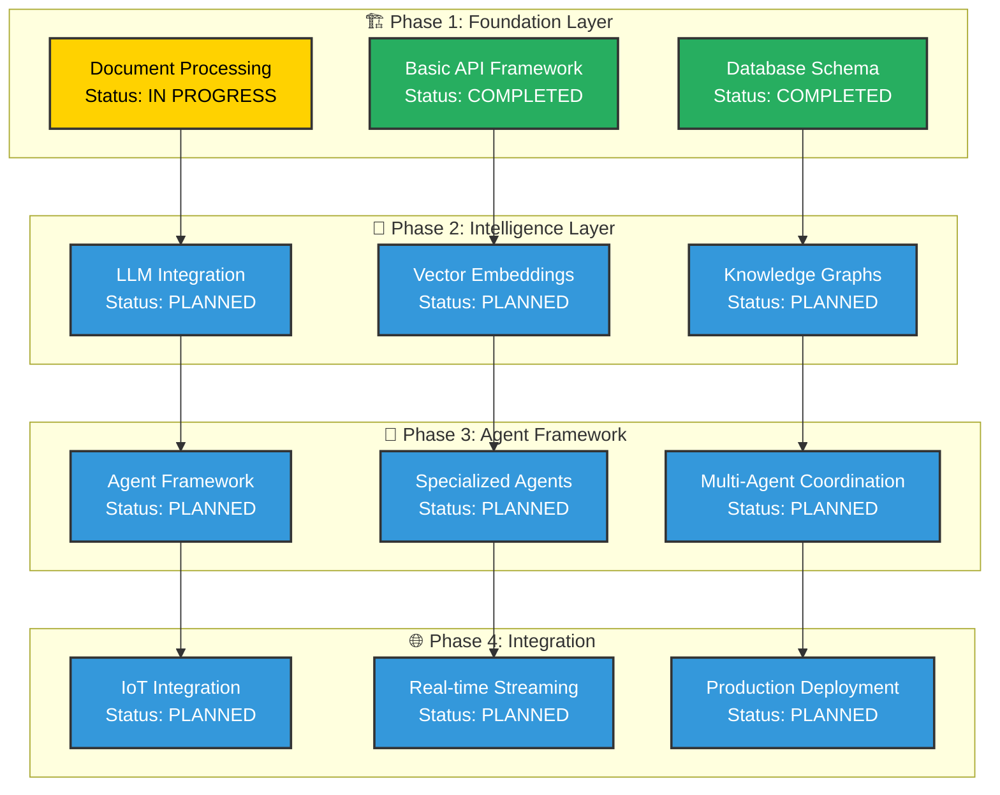

# EXPLAINIUM - Central Intelligence Hub Technical Architecture

*Building a "good life in a smart society" through excellence in applied AI science*

---

## 🎯 Executive Summary

**EXPLAINIUM** is the Central Intelligence Hub - the core brain of an AI-powered factory management system. EXPLAINIUM integrates three critical input layers—enterprise knowledge, multimodal sensing, and agent intelligence—to orchestrate an infinite network of specialized AI agents for industrial operations.

---

## 🏗️ System Architecture Overview

### 🎯 High-Level Architecture

*Complete system architecture showing EXPLAINIUM as the Central Intelligence Hub managing infinite AI agents*

---

## 🛠️ Technical Implementation Stack

### 🏗️ Technology Architecture

---

## 🚀 Implementation Roadmap

### 📋 Central Intelligence Hub Development Strategy

**Project Scope**: EXPLAINIUM focuses exclusively on building the **Central Intelligence Hub** - the core brain that manages all AI agents and data processing for factory optimization.

---

## 🔧 Technical Performance Standards

### ⚡ EXPLAINIUM Core Performance
- **Real-time Processing**: <100ms response time for critical decisions
- **Agent Coordination**: Unlimited concurrent agent management
- **System Availability**: 99.9% uptime with redundant failover
- **Scalability**: Linear performance scaling with agent count

### 🤖 Agent Network Metrics
- **Agent Spawning**: <50ms new agent instantiation time
- **Inter-Agent Communication**: <10ms message passing latency
- **Load Balancing**: Dynamic agent distribution across resources
- **Learning Convergence**: Continuous improvement tracking

---

*Developed with Turku UAS visual identity standards*
*© 2024 EXPLAINIUM Project - Building a good life in a smart society*
