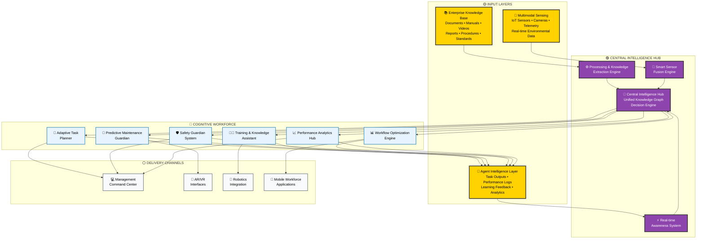
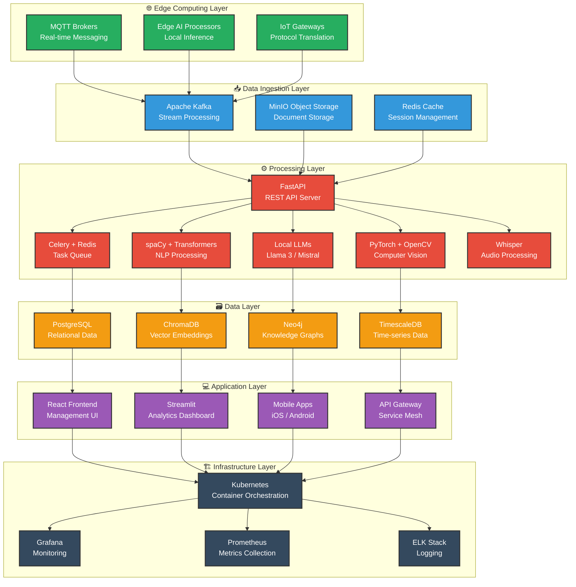
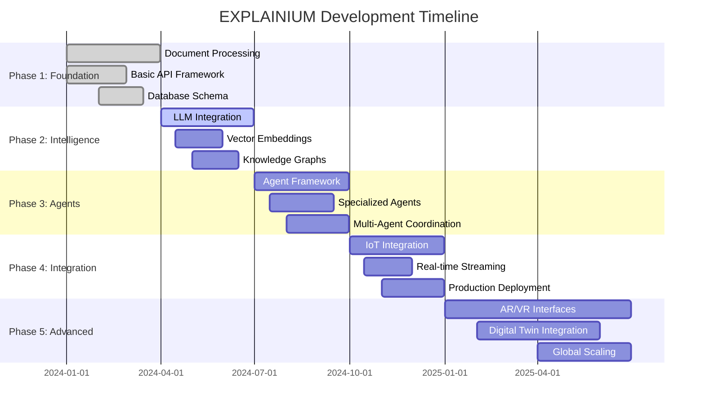

# EXPLAINIUM - Technical Architecture & Implementation Plan

*Building a "good life in a smart society" through excellence in applied AI science*

---

## 🎯 Executive Summary

**EXPLAINIUM** is an innovative AI-powered factory management system that creates a comprehensive digital nervous system for industrial operations. By integrating three critical input layers—enterprise knowledge, multimodal sensing, and agent intelligence—EXPLAINIUM delivers real-time intelligence through an infinite network of specialized AI agents.

---

## 🏗️ System Architecture Overview

### 🎯 High-Level Architecture

---

## 🛠️ Technical Implementation Stack

### 🏗️ Technology Architecture

---

## 🚀 Implementation Roadmap

### 📋 Phase-Based Development Strategy

---

## 📊 Success Metrics & KPIs

### 🎯 Operational Excellence Metrics
- **Equipment Downtime Reduction**: 40-60% decrease
- **Production Efficiency**: 25-35% OEE improvement
- **Quality Improvement**: 50-70% defect reduction
- **Energy Optimization**: 15-25% consumption reduction

### 👥 Workforce Enhancement Metrics
- **Training Time Reduction**: 60-80% faster onboarding
- **Safety Incident Reduction**: 90%+ decrease in accidents
- **Knowledge Retention**: 85%+ improvement
- **Employee Satisfaction**: Measurable engagement increase

### 💰 Financial Impact Metrics
- **Cost Savings**: $2-5M annual savings (medium facilities)
- **ROI Achievement**: 300-500% within 18-24 months
- **Revenue Growth**: 10-20% through productivity gains
- **Competitive Advantage**: Measurable market position improvement

---

*Developed with Turku UAS visual identity standards*
*© 2024 EXPLAINIUM Project - Building a good life in a smart society*
