# EXPLAINIUM - Central Intelligence Hub Technical Architecture


---

## 🎯 Executive Summary

**EXPLAINIUM** is the Central Intelligence Hub - the core brain of an AI-powered industrial intelligence system. EXPLAINIUM integrates three critical input layers (Company Tacit Knowledge, Multimodal Sensing, and Agent Generated Outputs) to orchestrate an infinite network of specialized AI agents for comprehensive factory management and optimization.

### 🏗️ Architecture Philosophy

EXPLAINIUM follows a **Central Brain Architecture** where all intelligence flows through a unified hub that:

- **Processes** company tacit knowledge to understand operations
- **Fuses** multimodal sensor data for real-time awareness
- **Coordinates** infinite AI agents for specialized tasks
- **Learns** continuously from agent outputs for optimization

---

## 🏗️ System Architecture Overview

### 🎯 High-Level Architecture


*Complete system architecture showing EXPLAINIUM as the Central Intelligence Hub managing infinite AI agents*

```mermaid
graph TB
    subgraph "🟡 INPUT LAYERS"
        EKB[📚 Company Tacit Knowledge<br/>Documentation · Manuals · Videos<br/>Training Materials · Reports · Emails]
        MMS[🔬 Multimodal Sensing<br/>IoT Sensors · Cameras · LiDAR<br/>Motion · Temperature · GPS]
        AIL[🤖 Agent Generated Outputs<br/>Task Status · Logs · Statistics<br/>Performance Analytics]
    end

    subgraph "🟣 CENTRAL INTELLIGENCE HUB"
        PKE[🧠 Knowledge Extraction<br/>Process Understanding]
        SSF[🔬 Smart Sensor Fusion<br/>Real-time Intelligence]
        RTA[⚡ Real-time Awareness<br/>Continuous Learning]
        CIH[🎯 EXPLAINIUM<br/>Central Brain<br/>Agent Orchestration]
    end

    subgraph "🔵 INFINITE AI AGENT NETWORK"
        ATP[🎯 Cognitive Task<br/>Planning Agents]
        PMG[🔧 Predictive Maintenance<br/>Agents]
        TKA[👨‍🏫 Training Assistant<br/>Agents]
        WOE[📊 Workflow Optimization<br/>Agents]
        SGS[🛡️ Safety Guardian<br/>Agents]
        PAH[📈 Performance Analytics<br/>Agents]
        MORE[♾️ ... Infinite More<br/>Specialized Agents]
    end

    subgraph "⚪ DELIVERY CHANNELS"
        MCC[💻 Management<br/>Dashboards]
        ARI[🥽 AR/VR<br/>Interfaces]
        RIN[🤖 Robotics<br/>Cobots]
        MWA[📱 Mobile<br/>Applications]
    end

    EKB --> PKE
    MMS --> SSF
    AIL --> RTA

    PKE --> CIH
    SSF --> CIH
    RTA --> CIH

    CIH --> ATP
    CIH --> PMG
    CIH --> TKA
    CIH --> WOE
    CIH --> SGS
    CIH --> PAH
    CIH --> MORE

    ATP --> MCC
    PMG --> ARI
    TKA --> RIN
    WOE --> MWA
    SGS --> MCC
    PAH --> MCC
    MORE --> MCC

    ATP --> AIL
    PMG --> AIL
    TKA --> AIL
    WOE --> AIL
    SGS --> AIL
    PAH --> AIL
    MORE --> AIL

    classDef inputLayer fill:#ffd200,stroke:#333,stroke-width:3px,color:#000
    classDef coreLayer fill:#8e44ad,stroke:#333,stroke-width:3px,color:#fff
    classDef agentLayer fill:#e8f4fd,stroke:#2980b9,stroke-width:2px,color:#000
    classDef deliveryLayer fill:#f8f9fa,stroke:#6c757d,stroke-width:2px,color:#000

    class EKB,MMS,AIL inputLayer
    class PKE,SSF,RTA,CIH coreLayer
    class ATP,PMG,TKA,WOE,SGS,PAH,MORE agentLayer
    class MCC,ARI,RIN,MWA deliveryLayer
```


---

## 📊 Three Input Layers - Technical Details

### 1️⃣ Company Tacit Knowledge Layer

**Purpose**: Transform institutional knowledge into actionable intelligence

**Data Sources**:
- **Enterprise Documentation**: Manuals, procedures, policies, standards (PDF, DOCX, TXT)
- **Training Materials**: Videos (MP4, AVI), presentations (PPT, PDF), photos (JPG, PNG)
- **Communication Data**: Emails (EML, MSG), reports (PDF, DOCX), scientific articles
- **Historical Knowledge**: Best practices, lessons learned, incident reports

**Processing Pipeline**:
```python
# Document Processing Architecture
class TacitKnowledgeProcessor:
    def __init__(self):
        self.text_extractor = MultiFormatTextExtractor()
        self.video_processor = VideoFrameExtractor()
        self.nlp_pipeline = spaCy + Transformers
        self.knowledge_graph = Neo4j()

    def process_document(self, file_path):
        # Extract text, images, metadata
        content = self.text_extractor.extract(file_path)

        # NLP processing for entity recognition
        entities = self.nlp_pipeline.extract_entities(content)

        # Build knowledge relationships
        self.knowledge_graph.add_relationships(entities)
```

### 2️⃣ Multimodal Sensing Layer

**Purpose**: Real-time environmental and operational awareness

**Sensor Categories**:
- **IoT Sensors**: Temperature, pressure, vibration, humidity, flow rates
- **Advanced Sensors**: LiDAR, photon sensors, motion detectors, GPS tracking
- **Computer Vision**: Quality inspection cameras, safety monitoring systems
- **Machine Telemetry**: Equipment status, performance metrics, diagnostics

**Data Streaming Architecture**:
```python
# Real-time Sensor Data Processing
class SensorFusionEngine:
    def __init__(self):
        self.mqtt_broker = MQTTBroker()
        self.kafka_stream = KafkaProducer()
        self.timeseries_db = TimescaleDB()
        self.edge_processors = EdgeAIProcessors()

    def process_sensor_data(self, sensor_data):
        # Edge processing for immediate decisions
        processed_data = self.edge_processors.analyze(sensor_data)

        # Stream to central hub
        self.kafka_stream.send('sensor-data', processed_data)

        # Store for historical analysis
        self.timeseries_db.insert(processed_data)
```

### 3️⃣ Agent Generated Outputs Layer

**Purpose**: Continuous learning and system optimization

**Output Categories**:
- **Task Execution Data**: Agent performance, decision traces, outcomes
- **Real-time Statistics**: KPIs, efficiency measurements, optimization results
- **Learning Feedback**: Model improvements, accuracy metrics, adaptations
- **Status Monitoring**: System health, agent coordination, performance logs

**Feedback Loop Architecture**:
```python
# Agent Output Processing System
class AgentOutputProcessor:
    def __init__(self):
        self.performance_tracker = PerformanceTracker()
        self.learning_engine = ContinuousLearning()
        self.optimization_engine = OptimizationEngine()

    def process_agent_output(self, agent_id, output_data):
        # Track agent performance
        metrics = self.performance_tracker.analyze(output_data)

        # Update learning models
        self.learning_engine.update_models(metrics)

        # Optimize system parameters
        self.optimization_engine.adjust_parameters(metrics)
```

---

## 🛠️ Technical Implementation Stack

### 🏗️ Comprehensive Technology Architecture

#### 🌐 Edge Computing Layer

**MQTT Brokers**: Eclipse Mosquitto for real-time device communication
- **Protocol Support**: MQTT 3.1.1/5.0, WebSocket, SSL/TLS
- **Scalability**: 100,000+ concurrent connections per broker
- **QoS Levels**: At-most-once, at-least-once, exactly-once delivery

**Edge AI Processors**: NVIDIA Jetson/Intel NUC for local inference
- **AI Frameworks**: TensorRT, OpenVINO for optimized inference
- **Local Models**: Lightweight versions of main AI models
- **Response Time**: <10ms for critical safety decisions

**IoT Gateways**: Protocol translation and data aggregation
- **Protocols**: Modbus, OPC-UA, CAN bus, Ethernet/IP
- **Security**: VPN tunneling, certificate-based authentication
- **Buffering**: Local data storage during network outages

#### 📥 Data Ingestion Layer

**Apache Kafka**: High-throughput distributed streaming platform
- **Throughput**: 1M+ messages/second per broker
- **Partitioning**: Horizontal scaling across multiple brokers
- **Retention**: Configurable data retention policies
- **Replication**: Multi-broker replication for fault tolerance

**MinIO Object Storage**: S3-compatible distributed object storage
- **Capacity**: Petabyte-scale storage capability
- **Erasure Coding**: Data protection and recovery
- **Versioning**: Document version control and history
- **Encryption**: AES-256 encryption at rest and in transit

**Redis Cache**: In-memory data structure store
- **Performance**: Sub-millisecond latency
- **Data Types**: Strings, hashes, lists, sets, sorted sets
- **Persistence**: RDB snapshots and AOF logging
- **Clustering**: Redis Cluster for horizontal scaling

#### ⚙️ Processing Layer

**FastAPI**: Modern, fast web framework for building APIs
- **Performance**: High-performance async/await support
- **Documentation**: Automatic OpenAPI/Swagger documentation
- **Validation**: Pydantic data validation and serialization
- **Authentication**: OAuth2, JWT token support

**Celery + Redis**: Distributed task queue system
- **Scalability**: Horizontal scaling with multiple workers
- **Monitoring**: Real-time task monitoring and management
- **Scheduling**: Periodic and delayed task execution
- **Error Handling**: Retry mechanisms and dead letter queues

**spaCy + Transformers**: Advanced NLP processing pipeline
- **Models**: Multi-language support (English, German, French, etc.)
- **Features**: Named entity recognition, dependency parsing, sentiment analysis
- **Custom Models**: Domain-specific model training and fine-tuning
- **Performance**: Optimized for production workloads

**Local LLMs**: On-premises large language models
- **Models**: Llama 3 (8B/70B), Mistral 7B, CodeLlama
- **Deployment**: vLLM for optimized inference serving
- **Quantization**: 4-bit/8-bit quantization for memory efficiency
- **Fine-tuning**: LoRA/QLoRA for domain adaptation

**PyTorch + OpenCV**: Computer vision and deep learning
- **Frameworks**: PyTorch 2.0+ with TorchScript compilation
- **Models**: YOLO, ResNet, EfficientNet for object detection
- **Processing**: Real-time video stream processing
- **Hardware**: CUDA/ROCm GPU acceleration

**Whisper**: Speech recognition and audio processing
- **Models**: Whisper Large-v3 for multilingual transcription
- **Languages**: 99+ language support
- **Accuracy**: Near-human level transcription accuracy
- **Real-time**: Streaming audio processing capability

#### 🗃️ Data Layer Architecture

**PostgreSQL**: Primary relational database
- **Version**: PostgreSQL 15+ with advanced features
- **Extensions**: PostGIS for spatial data, pg_vector for embeddings
- **Performance**: Connection pooling, query optimization
- **Backup**: Point-in-time recovery and streaming replication

**ChromaDB**: Vector database for semantic search
- **Embeddings**: Support for multiple embedding models
- **Similarity**: Cosine, L2, and IP distance metrics
- **Filtering**: Metadata filtering and hybrid search
- **Scalability**: Distributed deployment support

**TimescaleDB**: Time-series database for sensor data
- **Compression**: Automatic data compression and retention
- **Aggregation**: Continuous aggregates for real-time analytics
- **Scaling**: Multi-node distributed deployment
- **Integration**: Native PostgreSQL compatibility

**Neo4j**: Graph database for knowledge relationships
- **Query Language**: Cypher for complex graph queries
- **Algorithms**: Built-in graph algorithms (PageRank, community detection)
- **Visualization**: Graph visualization and exploration tools
- **Clustering**: Causal clustering for high availability

#### 💻 Application Layer

**React Frontend**: Modern management dashboard
- **Framework**: React 18+ with TypeScript
- **State Management**: Redux Toolkit for complex state
- **UI Components**: Material-UI/Ant Design component library
- **Real-time**: WebSocket connections for live updates

**Streamlit**: Interactive analytics dashboard
- **Deployment**: Multi-page applications with navigation
- **Visualization**: Plotly, Altair for interactive charts
- **Caching**: Built-in caching for performance optimization
- **Authentication**: Integration with enterprise SSO

**Mobile Applications**: iOS/Android field worker apps
- **Framework**: React Native for cross-platform development
- **Offline**: Offline-first architecture with sync capabilities
- **Push Notifications**: Real-time alerts and task assignments
- **Biometric**: Fingerprint/face authentication for security

#### 🏗️ Infrastructure Layer

**Kubernetes**: Container orchestration platform
- **Version**: Kubernetes 1.28+ with advanced scheduling
- **Networking**: Istio service mesh for microservices
- **Storage**: Persistent volumes with CSI drivers
- **Security**: RBAC, network policies, pod security standards

**Monitoring Stack**: Comprehensive observability
- **Grafana**: Visualization and alerting dashboards
- **Prometheus**: Metrics collection and time-series storage
- **Jaeger**: Distributed tracing for microservices
- **ELK Stack**: Centralized logging and log analysis

---

## ♾️ Infinite Agent Architecture

### 🤖 Agent Orchestration Framework

**EXPLAINIUM** supports unlimited AI agents through a sophisticated orchestration system:

```python
# Infinite Agent Orchestration System
class ExplainiumAgentOrchestrator:
    def __init__(self):
        self.agent_registry = AgentRegistry()
        self.resource_manager = ResourceManager()
        self.task_scheduler = TaskScheduler()
        self.communication_hub = CommunicationHub()

    def spawn_agent(self, agent_type, specialization=None):
        """Dynamically create new agent instances"""
        agent_config = self.get_agent_config(agent_type, specialization)
        agent = AgentFactory.create(agent_config)

        # Register agent in the system
        agent_id = self.agent_registry.register(agent)

        # Allocate resources
        self.resource_manager.allocate(agent_id, agent.resource_requirements)

        return agent_id

    def scale_agents(self, workload_metrics):
        """Auto-scale agent population based on demand"""
        for agent_type, demand in workload_metrics.items():
            current_capacity = self.get_capacity(agent_type)
            if demand > current_capacity:
                agents_needed = demand - current_capacity
                self.spawn_agent_cluster(agent_type, agents_needed)

    def coordinate_infinite_agents(self, factory_state):
        """Coordinate unlimited number of agents"""
        active_agents = self.agent_registry.get_active_agents()

        # Distribute factory state to all agents
        for agent in active_agents:
            agent.update_context(factory_state)

        # Facilitate inter-agent communication
        self.communication_hub.broadcast_updates()
```

### 🎯 Specialized Agent Categories

**Cognitive Task Planning Agents**
- **Function**: Intelligent task assignment and workflow optimization
- **Capabilities**: Resource allocation, deadline management, priority scheduling
- **Learning**: Continuous optimization based on completion rates and efficiency

**Predictive Maintenance Agents**
- **Function**: Equipment health monitoring and failure prediction
- **Capabilities**: Vibration analysis, thermal monitoring, wear pattern recognition
- **Learning**: Historical failure data analysis and predictive model refinement

**Training Assistant Agents**
- **Function**: Personalized employee training and skill development
- **Capabilities**: Adaptive learning paths, competency assessment, knowledge gaps identification
- **Learning**: Individual learning style adaptation and progress tracking

**Safety Guardian Agents**
- **Function**: Real-time safety monitoring and incident prevention
- **Capabilities**: PPE compliance checking, hazard detection, emergency response
- **Learning**: Incident pattern analysis and safety protocol optimization

**Workflow Optimization Agents**
- **Function**: Continuous process improvement and bottleneck resolution
- **Capabilities**: Process mining, efficiency analysis, resource optimization
- **Learning**: Performance pattern recognition and optimization strategy development

### 🔄 Agent Scaling Architecture

**Horizontal Scaling**: Automatic distribution across compute nodes
- **Load Balancing**: Intelligent task distribution based on agent capabilities
- **Resource Pooling**: Shared memory and processing resources for efficiency
- **Auto-Scaling**: Dynamic agent population adjustment based on workload

**Fault Tolerance**: Automatic agent recovery and task redistribution
- **Health Monitoring**: Continuous agent health checks and performance monitoring
- **Failover**: Automatic task reassignment when agents become unavailable
- **Recovery**: Automatic agent restart and state restoration

---

## 🔒 Security Architecture

### 🛡️ Multi-Layer Security

**Network Security**
- **Firewall**: Next-generation firewall with deep packet inspection
- **VPN**: Site-to-site VPN for secure remote access
- **Network Segmentation**: Isolated networks for different security zones
- **Intrusion Detection**: Real-time network monitoring and threat detection

**Application Security**
- **Authentication**: Multi-factor authentication with enterprise SSO
- **Authorization**: Role-based access control (RBAC) with fine-grained permissions
- **API Security**: OAuth2/JWT tokens with rate limiting and validation
- **Data Encryption**: AES-256 encryption for data at rest and in transit

**Infrastructure Security**
- **Container Security**: Image scanning and runtime protection
- **Secrets Management**: HashiCorp Vault for secure credential storage
- **Compliance**: SOC 2, ISO 27001, GDPR compliance frameworks
- **Audit Logging**: Comprehensive audit trails for all system activities

---

## 🚀 Implementation Roadmap

### 📋 Central Intelligence Hub Development Strategy

**Project Scope**: EXPLAINIUM focuses exclusively on building the **Central Intelligence Hub** - the core brain that manages all AI agents and data processing for factory optimization.


---

## 🚀 Deployment Architecture

### 🏗️ Production Deployment Strategy

**Multi-Environment Setup**
- **Development**: Local development with Docker Compose
- **Staging**: Kubernetes cluster for integration testing
- **Production**: High-availability Kubernetes deployment
- **Disaster Recovery**: Multi-region backup and failover

**Container Strategy**
```yaml
# Kubernetes Deployment Example
apiVersion: apps/v1
kind: Deployment
metadata:
  name: explainium-core
  namespace: explainium
spec:
  replicas: 3
  strategy:
    type: RollingUpdate
    rollingUpdate:
      maxSurge: 1
      maxUnavailable: 0
  selector:
    matchLabels:
      app: explainium-core
  template:
    metadata:
      labels:
        app: explainium-core
    spec:
      containers:
      - name: api-server
        image: explainium/core:latest
        ports:
        - containerPort: 8000
        env:
        - name: DATABASE_URL
          valueFrom:
            secretKeyRef:
              name: db-credentials
              key: url
        resources:
          requests:
            memory: "2Gi"
            cpu: "1000m"
          limits:
            memory: "4Gi"
            cpu: "2000m"
        livenessProbe:
          httpGet:
            path: /health
            port: 8000
          initialDelaySeconds: 30
          periodSeconds: 10
        readinessProbe:
          httpGet:
            path: /ready
            port: 8000
          initialDelaySeconds: 5
          periodSeconds: 5
```

### 🔧 Hardware Requirements

**Minimum Production Setup**
- **CPU**: 32 cores (Intel Xeon/AMD EPYC)
- **RAM**: 128GB DDR4/DDR5
- **Storage**: 10TB NVMe SSD (RAID 10)
- **GPU**: NVIDIA RTX 4090 or Tesla V100 (for AI workloads)
- **Network**: 10Gbps Ethernet

**Recommended Enterprise Setup**
- **CPU**: 64+ cores across multiple nodes
- **RAM**: 256GB+ per node
- **Storage**: 50TB+ distributed storage (Ceph/GlusterFS)
- **GPU**: Multiple NVIDIA H100/A100 GPUs
- **Network**: 25Gbps+ with redundant connections

### 📊 Performance Benchmarks

**System Performance Targets**
- **API Response Time**: <50ms for 95th percentile
- **Document Processing**: 100+ documents/minute
- **Sensor Data Throughput**: 1M+ data points/second
- **Agent Coordination**: <10ms inter-agent communication
- **Database Queries**: <10ms for 99th percentile

**Scalability Metrics**
- **Horizontal Scaling**: Linear performance up to 100+ nodes
- **Agent Scaling**: Support for 10,000+ concurrent agents
- **Data Volume**: Petabyte-scale data processing capability
- **Concurrent Users**: 1,000+ simultaneous users


---

## 🔮 Future Enhancements

### 🚀 Advanced Features Roadmap

**Phase 5: Advanced AI Capabilities**
- **Multimodal AI**: Vision-language models for complex understanding
- **Federated Learning**: Distributed learning across multiple factories
- **Quantum Computing**: Quantum algorithms for optimization problems
- **Digital Twins**: Complete factory digital twin integration

**Phase 6: Industry Expansion**
- **Vertical Specialization**: Industry-specific agent templates
- **Global Deployment**: Multi-region, multi-language support
- **Partner Ecosystem**: Third-party integration marketplace
- **AI Marketplace**: Shareable agent models and configurations

---

**© 2025 EXPLAINIUM Project**
