# EXPLAINIUM - Technical Architecture & Implementation Plan

*Building a "good life in a smart society" through excellence in applied AI science*

---

## 🎯 Executive Summary

**EXPLAINIUM** is an innovative AI-powered factory management system that creates a comprehensive digital nervous system for industrial operations. By integrating three critical input layers—enterprise knowledge, multimodal sensing, and agent intelligence—EXPLAINIUM delivers real-time intelligence through an infinite network of specialized AI agents.

---

## 🏗️ System Architecture Overview

### 🎯 High-Level Architecture

```mermaid
graph TB
    subgraph "🟡 INPUT LAYERS"
        EKB[📚 Enterprise Knowledge Base<br/>Documents • Manuals • Videos<br/>Reports • Procedures • Standards]
        MMS[🔬 Multimodal Sensing<br/>IoT Sensors • Cameras • Telemetry<br/>Real-time Environmental Data]
        AIL[🤖 Agent Intelligence Layer<br/>Task Outputs • Performance Logs<br/>Learning Feedback • Analytics]
    end
    
    subgraph "🟣 CENTRAL INTELLIGENCE HUB"
        PKE[⚙️ Processing & Knowledge<br/>Extraction Engine]
        SSF[🔄 Smart Sensor<br/>Fusion Engine]
        RTA[⚡ Real-time<br/>Awareness System]
        
        PKE --> CIH[🧠 Central Intelligence Hub<br/>Unified Knowledge Graph<br/>Decision Engine]
        SSF --> CIH
        RTA --> CIH
    end
    
    subgraph "🔵 COGNITIVE WORKFORCE"
        ATP[🎯 Adaptive Task<br/>Planner]
        PMG[🔧 Predictive Maintenance<br/>Guardian]
        TKA[👨‍🏫 Training & Knowledge<br/>Assistant]
        WOE[📊 Workflow Optimization<br/>Engine]
        SGS[🛡️ Safety Guardian<br/>System]
        PAH[📈 Performance Analytics<br/>Hub]
    end
    
    subgraph "⚪ DELIVERY CHANNELS"
        MCC[💻 Management<br/>Command Center]
        ARI[🥽 AR/VR<br/>Interfaces]
        RIN[🤖 Robotics<br/>Integration]
        MWA[📱 Mobile Workforce<br/>Applications]
    end
    
    EKB --> PKE
    MMS --> SSF
    AIL --> RTA
    
    CIH --> ATP
    CIH --> PMG
    CIH --> TKA
    CIH --> WOE
    CIH --> SGS
    CIH --> PAH
    
    ATP --> MCC
    PMG --> ARI
    TKA --> RIN
    WOE --> MWA
    SGS --> MCC
    PAH --> MCC
    
    ATP --> AIL
    PMG --> AIL
    TKA --> AIL
    WOE --> AIL
    SGS --> AIL
    PAH --> AIL
    
    classDef inputLayer fill:#ffd200,stroke:#333,stroke-width:3px,color:#000
    classDef coreLayer fill:#8e44ad,stroke:#333,stroke-width:3px,color:#fff
    classDef agentLayer fill:#e8f4fd,stroke:#2980b9,stroke-width:2px,color:#000
    classDef deliveryLayer fill:#f8f9fa,stroke:#6c757d,stroke-width:2px,color:#000
    
    class EKB,MMS,AIL inputLayer
    class PKE,SSF,RTA,CIH coreLayer
    class ATP,PMG,TKA,WOE,SGS,PAH agentLayer
    class MCC,ARI,RIN,MWA deliveryLayer
```

---

## 🛠️ Technical Implementation Stack

### 🏗️ Technology Architecture

---

## 🚀 Implementation Roadmap

### 📋 Central Intelligence Hub Development Strategy

**Project Scope**: EXPLAINIUM focuses exclusively on building the **Central Intelligence Hub** - the core brain that manages all AI agents and data processing for factory optimization.

---

## 📊 Success Metrics & KPIs

### 🎯 Operational Excellence Metrics
- **Equipment Downtime Reduction**: 40-60% decrease
- **Production Efficiency**: 25-35% OEE improvement
- **Quality Improvement**: 50-70% defect reduction
- **Energy Optimization**: 15-25% consumption reduction

### 👥 Workforce Enhancement Metrics
- **Training Time Reduction**: 60-80% faster onboarding
- **Safety Incident Reduction**: 90%+ decrease in accidents
- **Knowledge Retention**: 85%+ improvement
- **Employee Satisfaction**: Measurable engagement increase

### 💰 Financial Impact Metrics
- **Cost Savings**: $2-5M annual savings (medium facilities)
- **ROI Achievement**: 300-500% within 18-24 months
- **Revenue Growth**: 10-20% through productivity gains
- **Competitive Advantage**: Measurable market position improvement

---

*Developed with Turku UAS visual identity standards*
*© 2024 EXPLAINIUM Project - Building a good life in a smart society*
