```mermaid
graph TB
    subgraph "🟡 INPUT LAYERS"
        EKB[📚 Enterprise Knowledge Base<br/>Documents • Manuals • Videos<br/>Reports • Procedures • Standards]
        MMS[🔬 Multimodal Sensing<br/>IoT Sensors • Cameras • Telemetry<br/>Real-time Environmental Data]
        AIL[🤖 Agent Intelligence Layer<br/>Task Outputs • Performance Logs<br/>Learning Feedback • Analytics]
    end
    
    subgraph "🟣 CENTRAL INTELLIGENCE HUB"
        CIH[🧠 Central Intelligence Hub<br/>Unified Knowledge Graph<br/>Decision Engine]
    end
    
    subgraph "🔵 COGNITIVE WORKFORCE"
        AGENTS[🤖 Infinite AI Agents<br/>Specialized & Adaptive]
    end
    
    subgraph "⚪ DELIVERY CHANNELS"
        INTERFACES[📱 Multi-Modal Interfaces<br/>Management • Mobile • AR/VR • Robotics]
    end
    
    EKB --> CIH
    MMS --> CIH
    AIL --> CIH
    
    CIH --> AGENTS
    AGENTS --> INTERFACES
    AGENTS --> AIL
    
    classDef inputStyle fill:#ffd200,stroke:#333,stroke-width:3px,color:#000
    classDef coreStyle fill:#8e44ad,stroke:#333,stroke-width:3px,color:#fff
    classDef agentStyle fill:#e8f4fd,stroke:#2980b9,stroke-width:2px,color:#000
    classDef deliveryStyle fill:#f8f9fa,stroke:#6c757d,stroke-width:2px,color:#000
    
    class EKB,MMS,AIL inputStyle
    class CIH coreStyle
    class AGENTS agentStyle
    class INTERFACES deliveryStyle
```

# EXPLAINIUM - Project Summary & Recommendations

*Professional AI Factory Management System - Executive Summary*

---

## 🎯 Project Overview

**EXPLAINIUM** is a comprehensive AI-powered factory management system that transforms traditional industrial operations into intelligent, self-optimizing environments. The system integrates three critical input layers to deliver real-time intelligence through an infinite network of specialized AI agents.

### 🏆 Key Achievements

✅ **Architecture Optimization**: Refined naming conventions and added missing components  
✅ **Professional Documentation**: Created comprehensive technical documentation  
✅ **Clean Diagrams**: Developed professional Mermaid diagrams following Turku UAS standards  
✅ **PH-1 Cleanup**: Reorganized and professionalized the foundation module  
✅ **Technical Stack**: Defined complete technology implementation roadmap  

---

## 🏗️ Optimized Architecture

### 📊 Improved System Design

**Original Issues Fixed:**
- ❌ "Company Tacit Knowledge" → ✅ **"Enterprise Knowledge Base"**
- ❌ "Agent's Generated Outputs" → ✅ **"Agent Intelligence Layer"**
- ❌ Missing security components → ✅ **Added Security & Compliance Layer**
- ❌ Unclear data flow → ✅ **Clear processing pipelines**

### 🎯 Enhanced Three-Layer Architecture

---

## 🛠️ Technology Stack Recommendations

### 🏗️ Production-Ready Architecture

**Core Infrastructure:**
- **Container Orchestration**: Kubernetes for scalability
- **Message Streaming**: Apache Kafka for real-time data
- **Load Balancing**: Nginx for high availability
- **Monitoring**: Grafana + Prometheus for observability

**AI/ML Stack:**
- **Local LLMs**: Llama 3/Mistral for on-premises processing
- **Vector Database**: ChromaDB for semantic search
- **Knowledge Graphs**: Neo4j for relationship mapping
- **Computer Vision**: PyTorch + OpenCV for visual processing

**Data Layer:**
- **Primary Database**: PostgreSQL for structured data
- **Time-series**: TimescaleDB for sensor data
- **Caching**: Redis for performance optimization
- **Object Storage**: MinIO for document storage

---

## 📊 Implementation Roadmap

### 🚀 Phase-Based Development

**Project Scope**: EXPLAINIUM focuses exclusively on building the **Central Intelligence Hub** - the core brain that manages all AI agents and data processing for factory optimization.

```mermaid
graph LR
    subgraph "🏗️ Phase 1: Foundation"
        P1[Document Processing<br/>API Framework<br/>Database Schema<br/>Status: IN PROGRESS]
    end

    subgraph "🧠 Phase 2: Intelligence"
        P2[LLM Integration<br/>Vector Embeddings<br/>Knowledge Graphs<br/>Status: PLANNED]
    end

    subgraph "🤖 Phase 3: Agents"
        P3[Agent Framework<br/>Specialized Agents<br/>Multi-Agent System<br/>Status: PLANNED]
    end

    subgraph "🌐 Phase 4: Integration"
        P4[IoT Integration<br/>Real-time Streaming<br/>Production Deployment<br/>Status: PLANNED]
    end

    P1 --> P2 --> P3 --> P4

    classDef inProgress fill:#ffd200,stroke:#333,stroke-width:2px,color:#000
    classDef planned fill:#3498db,stroke:#333,stroke-width:2px,color:#fff

    class P1 inProgress
    class P2,P3,P4 planned
```

---

## 🧹 PH-1 Module Improvements

### ✅ **Completed Optimizations:**

1. **Renamed Phase1 → PH-1** for consistency
2. **Added comprehensive README** with professional documentation
3. **Created ARCHITECTURE.md** with detailed technical diagrams
4. **Enhanced main.py** with proper headers and metadata
5. **Improved API documentation** with rich descriptions
6. **Added Turku UAS branding** throughout the interface

### 📊 **PH-1 Current Status:**

```mermaid
graph LR
    subgraph "🔄 IN PROGRESS"
        DOC[📄 Document Processing]
        API[🔗 REST API]
        DB[🗃️ Database Schema]
        NLP[🧠 Basic NLP]
        WEB[🌐 Web Interface]
    end

    subgraph "📋 PLANNED"
        LLM[🤖 LLM Integration]
        VECTOR[🎯 Vector Search]
        GRAPH[🕸️ Knowledge Graphs]
        ADVANCED[⚡ Advanced Features]
    end

    DOC --> LLM
    API --> VECTOR
    DB --> GRAPH
    NLP --> ADVANCED
    WEB --> ADVANCED

    classDef inProgressStyle fill:#ffd200,stroke:#333,stroke-width:2px,color:#000
    classDef plannedStyle fill:#3498db,stroke:#333,stroke-width:2px,color:#fff

    class DOC,API,DB,NLP,WEB inProgressStyle
    class LLM,VECTOR,GRAPH,ADVANCED plannedStyle
```

---

## 💡 Development Priorities

### 🎯 **Phase 1 Completion:**

1. **Security Implementation**
   - Add authentication and authorization
   - Implement data encryption
   - Set up audit logging

2. **Performance Optimization**
   - Add caching layer with Redis
   - Implement async processing with Celery
   - Optimize database queries

3. **Testing & Quality**
   - Expand test coverage to 90%+
   - Add integration tests
   - Implement CI/CD pipeline

### 🚀 **Phase 2 Development:**

1. **AI Enhancement**
   - Integrate local LLM (Llama 3)
   - Add vector embeddings (ChromaDB)
   - Implement knowledge graphs (Neo4j)

2. **Scalability**
   - Containerize with Docker
   - Deploy on Kubernetes
   - Add horizontal scaling

3. **User Experience**
   - Develop React frontend
   - Create mobile applications
   - Add AR/VR interfaces

### 🌟 **Advanced Phases:**

1. **Full Agent Network**
   - Multi-agent orchestration
   - Specialized industrial agents
   - Real-time decision making

2. **IoT Integration**
   - Sensor data streaming
   - Edge computing deployment
   - Predictive analytics

3. **Industry Expansion**
   - Vertical-specific customizations
   - Global deployment capabilities
   - Enterprise partnerships

---

## 📈 Success Metrics

### 🎯 **Technical KPIs:**
- **Processing Speed**: 1000+ documents/hour
- **Accuracy**: 95%+ entity recognition
- **Uptime**: 99.9% system availability
- **Response Time**: <200ms API responses

### 💰 **Business Impact:**
- **Cost Reduction**: 30-50% operational savings
- **Efficiency Gains**: 25-35% productivity improvement
- **Safety Enhancement**: 90%+ incident reduction
- **ROI**: 300-500% within 18-24 months

---

## 🎨 Visual Identity Compliance

### ✅ **Turku UAS Standards Applied:**

- **Typography**: PT Sans fonts throughout
- **Colors**: Yellow (#ffd200) as primary highlight
- **Design**: Clean, professional layouts
- **Branding**: Consistent logo placement
- **Messaging**: Expert but approachable tone
- **Whitespace**: Ample spacing for clarity

---

## 🔮 Strategic Implementation

### 📋 **Development Priorities:**

1. **Architecture Optimization** for Central Intelligence Hub
2. **Security Enhancement** implementation in PH-1
3. **Phase 2 Development** initiation (LLM integration)
4. **CI/CD Pipeline** establishment for automated testing
5. **Stakeholder Demonstration** planning and execution

### 🤝 **Partnership Strategy:**

- **Academic Partnerships** for research validation
- **Industry Pilots** for real-world testing
- **Technology Partnerships** for component integration
- **Funding Opportunities** for accelerated development

---

*This project represents a significant advancement in industrial AI applications, positioning Turku UAS as a leader in applied AI science for smart manufacturing.*

**© 2024 EXPLAINIUM Project - Building a good life in a smart society through excellence in applied AI science**
