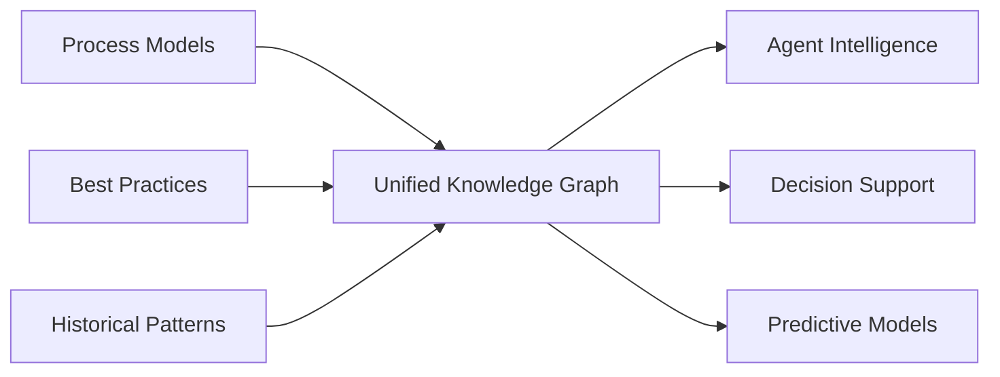

# EXPLAINIUM - AI Factory Management System
## Professional Technical Architecture & Implementation Plan


*Building a "good life in a smart society" through excellence in applied AI science*

---

## 🎯 Executive Summary

**EXPLAINIUM** is an innovative AI-powered factory management system that creates a comprehensive digital nervous system for industrial operations. By integrating three critical input layers—company tacit knowledge, multimodal sensing, and agent outputs—EXPLAINIUM delivers real-time intelligence through an infinite network of specialized AI agents.

### 🏆 Core Value Proposition
- **360° Factory Intelligence**: Complete visibility and understanding of all factory operations
- **Predictive Excellence**: Proactive maintenance, safety, and optimization
- **Adaptive Learning**: Continuous improvement through real-time feedback loops
- **Privacy-First Architecture**: Secure, on-premises deployment for industrial security
- **Infinite Scalability**: Unlimited AI agents tailored to specific factory needs

### 🎯 Key Objectives
- Transform traditional factories into intelligent, self-optimizing systems
- Reduce operational costs by 30-50% through predictive analytics
- Eliminate safety incidents through real-time monitoring and intervention
- Accelerate training and knowledge transfer for new employees
- Create digital twins of factory processes for optimization

---

## 🏗️ System Architecture Overview

### 📊 Three-Layer Input Architecture

#### 1️⃣ Company Tacit Knowledge Layer
**Purpose**: Transform institutional knowledge into actionable intelligence

- **Enterprise Documentation**: Manuals, procedures, policies
- **Training Materials**: Videos, presentations, e-learning content
- **Historical Data**: Reports, incident logs, best practices
- **Multimedia Content**: Images, diagrams, technical drawings

**Processing Pipeline**:
```
Documents → OCR/NLP → Knowledge Extraction → Semantic Understanding → Knowledge Graph
```

#### 2️⃣ Multimodal Sensing Layer
**Purpose**: Real-time environmental and operational awareness

- **IoT Sensor Network**: Temperature, pressure, vibration, humidity
- **Computer Vision**: Quality inspection, safety monitoring, workflow tracking
- **Machine Telemetry**: Equipment status, performance metrics, diagnostics
- **Environmental Monitoring**: Air quality, noise levels, energy consumption

**Processing Pipeline**:
```
Raw Sensors → Edge Processing → Data Fusion → Pattern Recognition → Real-time Alerts
```

#### 3️⃣ Agent Output Layer
**Purpose**: Continuous learning and system optimization

- **Task Execution Logs**: Agent performance, decision traces
- **Learning Feedback**: Model improvements, accuracy metrics
- **Performance Analytics**: KPIs, efficiency measurements
- **Collaborative Intelligence**: Inter-agent communication, knowledge sharing

**Processing Pipeline**:
```
Agent Data → Performance Analysis → Learning Updates → System Optimization → Feedback Loop
```

---

## 🧠 EXPLAINIUM Core - Central Intelligence Hub

### 🔄 Processing & Knowledge Extraction Engine

**Mission**: Transform raw data into actionable factory intelligence

#### Document Intelligence Pipeline
- **Multi-format Processing**: PDF, DOCX, XLSX, PPT, images, videos
- **Advanced OCR**: Tesseract + PaddleOCR for multilingual support
- **Layout Understanding**: Detectron2 for document structure analysis
- **Table Recognition**: Table-Transformer for complex data extraction
- **Technical Diagram Analysis**: Custom models for flowcharts and schematics

#### Smart Sensor Fusion Engine
- **Real-time Data Processing**: Stream processing with Apache Kafka
- **Pattern Recognition**: ML models for anomaly detection
- **Predictive Analytics**: Time-series forecasting for maintenance
- **Multi-sensor Correlation**: Fusion algorithms for comprehensive insights

#### Real-time Awareness System
- **Context Understanding**: Situation assessment and decision support
- **Event Correlation**: Cross-system pattern recognition
- **Alert Generation**: Intelligent notification system
- **Performance Monitoring**: Real-time KPI tracking and analysis

### 🗄️ Knowledge Base Architecture



**Core Components**:
- **Process Models**: Digital representations of factory workflows
- **Best Practices Database**: Curated knowledge from expert operations
- **Historical Pattern Analysis**: Learning from past performance data
- **Semantic Knowledge Graph**: Interconnected factory intelligence network

---

## 🎯 Cognitive Workforce - Infinite AI Agent Network

### 🤖 Specialized Agent Categories

#### 🎯 Adaptive Task Planner
- **Mission**: Dynamic workflow optimization and resource allocation
- **Capabilities**: Real-time scheduling, bottleneck identification, efficiency optimization
- **Technologies**: Reinforcement learning, constraint optimization, graph algorithms

#### 🔧 Predictive Maintenance Guardian
- **Mission**: Prevent equipment failures before they occur
- **Capabilities**: Vibration analysis, thermal monitoring, wear prediction
- **Technologies**: Time-series analysis, anomaly detection, digital twin modeling

#### 👨‍🏫 Training & Knowledge Assistant
- **Mission**: Accelerate employee onboarding and skill development
- **Capabilities**: Personalized learning paths, AR-guided training, competency assessment
- **Technologies**: Natural language processing, computer vision, adaptive learning

#### 📊 Workflow Optimization Engine
- **Mission**: Continuous process improvement and efficiency gains
- **Capabilities**: Process mining, lean optimization, waste reduction
- **Technologies**: Process discovery algorithms, simulation modeling, optimization

#### 🛡️ Safety Guardian System
- **Mission**: Real-time safety monitoring and incident prevention
- **Capabilities**: PPE detection, hazard identification, emergency response
- **Technologies**: Computer vision, IoT sensors, risk assessment models

#### 📈 Performance Analytics Hub
- **Mission**: Comprehensive factory performance insights
- **Capabilities**: KPI tracking, trend analysis, predictive forecasting
- **Technologies**: Business intelligence, statistical analysis, machine learning

### 🔄 Agent Orchestration Framework

```python
# Multi-Agent Coordination
class AgentOrchestrator:
    def __init__(self):
        self.agents = {
            'task_planner': AdaptiveTaskPlanner(),
            'maintenance': PredictiveMaintenanceAgent(),
            'training': TrainingAssistant(),
            'workflow': WorkflowOptimizer(),
            'safety': SafetyGuardian(),
            'analytics': PerformanceAnalyzer()
        }

    def coordinate_agents(self, factory_state):
        # Real-time agent coordination logic
        pass
```

---

## 🛠️ Technical Implementation Stack

### 🏗️ Core Technology Architecture

#### 🌐 Edge Computing Layer
- **MQTT Brokers**: Real-time device communication and messaging
- **Edge AI Processors**: Local inference for immediate decision-making
- **IoT Gateways**: Protocol translation and data aggregation

#### 📥 Data Ingestion Layer
- **Apache Kafka**: High-throughput stream processing and event sourcing
- **MinIO Object Storage**: Scalable storage for documents and media files
- **Redis Cache**: High-performance caching and session management

#### ⚙️ Processing Layer

**Document Processing Pipeline**:
```python
# Core Framework
FastAPI          # REST API and async processing
Celery + Redis   # Background task queue management
spaCy + Transformers  # NLP and language understanding
Local LLMs       # Llama 3/Mistral for content analysis
```

**ML/AI Processing Stack**:
```python
# Deep Learning & Computer Vision
PyTorch          # Deep learning framework
OpenCV           # Computer vision and video processing
Whisper          # Audio transcription and speech recognition
Detectron2       # Document layout analysis
```

**Agent Orchestration Framework**:
```python
# Multi-Agent Systems
LangChain        # Agent orchestration and tool integration
AutoGen          # Multi-agent collaborative systems
CrewAI           # Specialized agent coordination
```

#### 🗃️ Data Layer Architecture

**Multi-Database Strategy for Optimal Performance**:

```python
# Database Ecosystem
PostgreSQL       # Relational data and ACID compliance
ChromaDB         # Vector embeddings and semantic search
TimescaleDB      # Time-series sensor data analytics
Neo4j            # Knowledge graphs and relationship mapping
```

#### 💻 Application Layer

**User Interface Ecosystem**:
- **React Frontend**: Modern management dashboards with real-time updates
- **Streamlit**: Interactive analytics and data visualization interfaces
- **Gradio**: AI model interfaces for testing and demonstrations
- **Mobile Apps**: iOS/Android applications for field workers

#### 🏗️ Infrastructure Layer

**Container Orchestration & Deployment**:
```yaml
# Kubernetes Deployment
apiVersion: apps/v1
kind: Deployment
metadata:
  name: explainium-core
spec:
  replicas: 3
  selector:
    matchLabels:
      app: explainium
  template:
    spec:
      containers:
      - name: api-server
        image: explainium/api:latest
        ports:
        - containerPort: 8000
```

**Monitoring & Observability**:
- **Grafana**: Real-time monitoring and alerting dashboards
- **Prometheus**: Metrics collection and time-series monitoring
- **ELK Stack**: Centralized logging and log analysis
- **Jaeger**: Distributed tracing for microservices

---

## 📱 Interface Ecosystem - Delivery Channels

### 🎯 Multi-Modal User Interfaces

#### 💻 Management Command Center
- **Executive Dashboards**: High-level KPIs and strategic insights
- **Operational Dashboards**: Real-time factory floor monitoring
- **Analytics Workbench**: Deep-dive analysis and reporting tools

#### 🥽 Immersive AR/VR Interfaces
- **Training Simulations**: Safe, virtual environment for skill development
- **Maintenance Guidance**: AR overlays for equipment repair procedures
- **Process Visualization**: 3D factory models and workflow visualization

#### 🤖 Robotics Integration
- **Collaborative Robots (Cobots)**: Direct agent-to-robot communication
- **Autonomous Vehicles**: AGV coordination and path optimization
- **Robotic Process Automation**: Automated task execution and monitoring

#### 📱 Mobile Workforce Applications
- **Field Worker Apps**: Real-time task assignments and status updates
- **Safety Compliance**: Mobile safety checklists and incident reporting
- **Knowledge Access**: On-demand access to procedures and documentation

---

## 🚀 Implementation Roadmap & Development Plan

### 📋 Phase-Based Development Strategy

#### 🏗️ Phase 1: Foundation Layer (Months 1-3)
**Status**: ✅ **COMPLETED** - PH-1 Implementation

- [x] Document ingestion and processing system
- [x] Basic text extraction (PDF, DOCX, TXT)
- [x] PostgreSQL database schema and API framework
- [x] Simple web interface for testing and validation
- [x] Image processing with OCR capabilities
- [x] Video frame extraction and storage

#### 🧠 Phase 2: Intelligence Layer (Months 4-6)
**Status**: 🔄 **IN PROGRESS**

- [ ] Local LLM integration (Llama 3/Mistral)
- [ ] Advanced NLP pipeline with entity recognition
- [ ] Vector embeddings and semantic search (ChromaDB)
- [ ] Knowledge graph construction (Neo4j)
- [ ] Multi-modal content understanding

#### 🤖 Phase 3: Agent Framework (Months 7-9)
**Status**: 📋 **PLANNED**

- [ ] Multi-agent orchestration system (LangChain/AutoGen)
- [ ] Specialized agent development (maintenance, safety, training)
- [ ] Real-time decision-making capabilities
- [ ] Agent communication and coordination protocols
- [ ] Performance monitoring and optimization

#### 🌐 Phase 4: Integration & Deployment (Months 10-12)
**Status**: 📋 **PLANNED**

- [ ] IoT sensor integration and edge computing
- [ ] Real-time data streaming (Apache Kafka)
- [ ] Production-ready deployment (Kubernetes)
- [ ] Security hardening and compliance
- [ ] Comprehensive testing and validation

#### 🚀 Phase 5: Advanced Features (Months 13-18)
**Status**: 📋 **FUTURE**

- [ ] AR/VR interface development
- [ ] Advanced predictive analytics
- [ ] Digital twin integration
- [ ] Industry-specific customizations
- [ ] Global scaling and optimization

---

## 📊 Success Metrics & Business Impact

### 🎯 Key Performance Indicators (KPIs)

#### 🏭 Operational Excellence Metrics
- **Equipment Downtime Reduction**: Target 40-60% decrease in unplanned maintenance
- **Production Efficiency**: 25-35% improvement in overall equipment effectiveness (OEE)
- **Quality Improvement**: 50-70% reduction in defect rates through predictive quality control
- **Energy Optimization**: 15-25% reduction in energy consumption through smart optimization

#### 👥 Workforce Enhancement Metrics
- **Training Time Reduction**: 60-80% faster onboarding for new employees
- **Safety Incident Reduction**: 90%+ decrease in workplace accidents and near-misses
- **Knowledge Retention**: 85%+ improvement in procedural knowledge retention
- **Employee Satisfaction**: Measurable increase in job satisfaction and engagement

#### 💰 Financial Impact Metrics
- **Cost Savings**: $2-5M annual savings for medium-sized manufacturing facilities
- **ROI Achievement**: 300-500% return on investment within 18-24 months
- **Revenue Growth**: 10-20% increase through improved productivity and quality
- **Competitive Advantage**: Measurable market position improvement

### 📈 Technical Performance Benchmarks

#### ⚡ System Performance Standards
- **Real-time Processing**: <100ms response time for critical alerts
- **Document Processing**: 1000+ documents per hour processing capacity
- **Accuracy Targets**: 95%+ accuracy in knowledge extraction and decision-making
- **System Availability**: 99.9% uptime with redundant failover systems

#### 🔒 Security & Compliance Metrics
- **Data Privacy**: 100% on-premises processing with zero data leakage
- **Compliance Adherence**: Full compliance with industry standards (ISO, OSHA, etc.)
- **Security Audits**: Regular penetration testing and vulnerability assessments
- **Access Control**: Role-based permissions with complete audit trails

---

## 🌟 Competitive Advantages & Innovation

### 🚀 Unique Value Propositions

#### 🧠 Holistic Intelligence Integration
Unlike traditional factory management systems that focus on single aspects, EXPLAINIUM provides **comprehensive intelligence** by integrating tacit knowledge, real-time sensing, and agent feedback into a unified decision-making platform.

#### 🔄 Continuous Learning Architecture
The system's **self-improving design** ensures that performance gets better over time through continuous learning from operations, making it increasingly valuable as it accumulates experience.

#### 🛡️ Privacy-First Industrial AI
Complete **on-premises deployment** addresses critical industrial security concerns while providing enterprise-grade AI capabilities without compromising sensitive operational data.

#### ♾️ Infinite Scalability
The **agent-based architecture** allows unlimited expansion of capabilities, adapting to any factory size or complexity without architectural limitations.

---

### 7. Technology Considerations

#### 7.1 Hardware Requirements
```
 Recommended Setup:
- CPU: 16+ cores (Intel Xeon/AMD EPYC)
- RAM: 64GB+ (for large document processing)
- GPU: NVIDIA RTX 4090 or Tesla V100 (for ML workloads)
- Storage: 10TB+ NVMe SSD (for document storage)
- Network: 10Gbps for large file transfers
```

#### 7.2 Software Dependencies
```dockerfile
# Core ML Framework
FROM nvidia/cuda:11.8-runtime-ubuntu20.04

# Python ML Stack
RUN pip install torch torchvision transformers
RUN pip install spacy sentence-transformers
RUN pip install opencv-python pillow
RUN pip install whisper-openai

# Document Processing
RUN pip install pypdf2 pdfplumber python-docx
RUN pip install pandas openpyxl

# API and Database
RUN pip install fastapi uvicorn celery
RUN pip install psycopg2 redis
```

---

### 8. Integration Points

#### 8.1 API Design
```python
# RESTful API Endpoints
POST /api/v1/documents/upload
GET  /api/v1/documents/{id}/status
GET  /api/v1/documents/{id}/content
POST /api/v1/search/semantic
GET  /api/v1/knowledge-graph/{entity}
```

#### 8.2 Webhook Integration
```python
# Event-driven notifications
{
    "event": "document_processed",
    "document_id": "uuid",
    "status": "completed",
    "extracted_entities": [...],
    "confidence_score": 0.95
}
```

---

### 9. Success Metrics & Monitoring

#### 9.1 Performance KPIs
- **Processing Speed**: Documents per hour
- **Accuracy**: Entity extraction precision/recall
- **Scalability**: Concurrent processing capacity
- **Uptime**: System availability metrics

#### 9.2 Quality Metrics
- **Content Understanding**: Semantic similarity scores
- **Multi-modal Accuracy**: Cross-reference validation
- **Domain Adaptation**: Industry-specific performance

---

### 10. Risk Mitigation

#### 10.1 Technical Risks
- **Model Accuracy**: Implement confidence scoring and human-in-the-loop validation
- **Performance**: Load balancing and auto-scaling mechanisms
- **Data Quality**: Input validation and error handling

#### 10.2 Business Risks
- **Privacy Compliance**: Regular security audits and compliance checks
- **Vendor Lock-in**: Open-source stack with containerized deployment
- **Scalability**: Modular architecture for incremental growth
