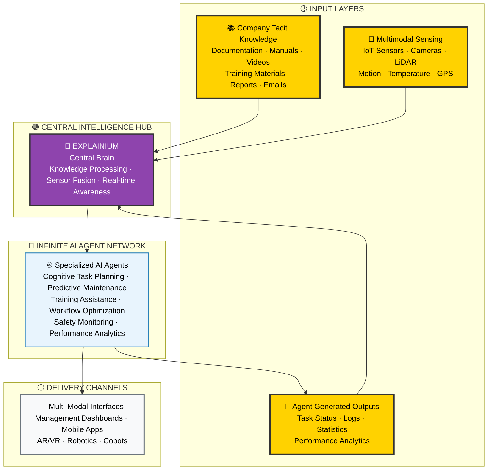

# EXPLAINIUM - Central Intelligence Hub

## AI-Powered Industrial Intelligence System

## 🎯 Executive Summary

**EXPLAINIUM** is the Central Intelligence Hub - a revolutionary AI system that serves as the central brain for industrial operations. By integrating three critical input layers with an infinite network of specialized AI agents, EXPLAINIUM transforms traditional factories into intelligent, self-optimizing environments.

### 🏆 Core Value Proposition

**EXPLAINIUM** delivers unprecedented industrial intelligence through:

- **🧠 Central Brain Architecture**: Unified intelligence hub processing all factory data
- **♾️ Infinite Agent Network**: Unlimited specialized AI agents for every operational need
- **🔄 Real-time Optimization**: Continuous learning and adaptation from live operations
- **🛡️ Predictive Excellence**: Proactive maintenance, safety, and quality assurance
- **📊 Complete Visibility**: 360° understanding of all factory processes and workflows

### 🎯 Strategic Objectives

- **Operational Excellence**: 30-50% cost reduction through intelligent automation
- **Zero Incidents**: Eliminate safety and quality issues through predictive monitoring
- **Accelerated Learning**: Instant knowledge transfer and training optimization
- **Digital Transformation**: Complete digitization of industrial processes
- **Competitive Advantage**: Industry-leading AI-powered manufacturing capabilities

---

## 🏗️ System Architecture

### 🎯 Three-Layer Input Architecture

EXPLAINIUM processes three critical input streams that feed the central intelligence hub:

### 📊 Input Layer Details

#### 1️⃣ Company Tacit Knowledge

**Purpose**: Transform institutional knowledge into actionable intelligence

- **Enterprise Documentation**: Manuals, procedures, policies, standards
- **Training Materials**: Videos, presentations, e-learning content, photos
- **Communication Data**: Emails, reports, scientific articles
- **Historical Knowledge**: Best practices, lessons learned, incident reports

#### 2️⃣ Multimodal Sensing

**Purpose**: Real-time environmental and operational awareness

- **IoT Sensor Network**: Temperature, pressure, vibration, humidity, flow rates
- **Advanced Sensors**: LiDAR, motion detectors, GPS tracking, photon sensors
- **Computer Vision**: Quality inspection, safety monitoring, workflow tracking
- **Machine Telemetry**: Equipment status, performance metrics, diagnostics

#### 3️⃣ Agent Generated Outputs

**Purpose**: Continuous learning and system optimization

- **Task Execution Data**: Agent performance, decision traces, outcomes
- **Real-time Statistics**: KPIs, efficiency measurements, optimization results
- **Learning Feedback**: Model improvements, accuracy metrics, adaptations
- **Status Monitoring**: System health, agent coordination, performance logs

---

## 🧠 EXPLAINIUM Central Intelligence Hub

### 🎯 Core Processing Functions

**EXPLAINIUM** serves as the central brain that:

1. **Knowledge Extraction**: Processes company tacit knowledge to understand operations, workflows, and requirements
2. **Smart Sensor Fusion**: Transforms raw sensor data into actionable intelligence
3. **Real-time Awareness**: Integrates agent outputs for continuous system optimization
4. **Agent Orchestration**: Coordinates infinite AI agents for specialized tasks

### ♾️ Infinite Agent Network

**EXPLAINIUM** orchestrates unlimited specialized AI agents including:

- **🔧 Predictive Maintenance Agents**: Prevent equipment failures before they occur
- **🛡️ Safety Guardian Agents**: Monitor and ensure worker safety in real-time
- **👨‍🏫 Training Assistant Agents**: Accelerate learning for new employees
- **📊 Workflow Optimization Agents**: Continuously improve operational efficiency
- **🎯 Cognitive Task Planning Agents**: Intelligent task assignment and scheduling
- **📈 Performance Analytics Agents**: Track and optimize all operational metrics

---

## 🛠️ Technology Stack

### 🏗️ Core Infrastructure

- **Container Orchestration**: Kubernetes for scalable deployment
- **Message Streaming**: Apache Kafka for real-time data processing
- **Load Balancing**: Nginx for high availability
- **Monitoring**: Grafana + Prometheus for system observability

### 🤖 AI/ML Stack

- **Local LLMs**: Llama 3/Mistral for on-premises processing
- **Vector Database**: ChromaDB for semantic search and knowledge retrieval
- **Knowledge Graphs**: Neo4j for relationship mapping and process understanding
- **Computer Vision**: PyTorch + OpenCV for visual processing and analysis

### 🗃️ Data Layer

- **Primary Database**: PostgreSQL for structured operational data
- **Time-series**: TimescaleDB for sensor data analytics
- **Caching**: Redis for performance optimization
- **Object Storage**: MinIO for document and media storage

---

## 📱 Delivery Channels

### 🎯 Multi-Modal User Interfaces

- **💻 Management Dashboards**: Executive and operational command centers
- **📱 Mobile Applications**: Field worker apps for real-time interaction
- **🥽 AR/VR Interfaces**: Immersive training and maintenance guidance
- **🤖 Robotics Integration**: Direct communication with cobots and autonomous systems

---

## 🚀 Implementation Roadmap

### 📋 Development Phases

**Phase 1: Foundation** (IN PROGRESS)
- Document processing and knowledge extraction
- Basic API framework and database schema
- Core intelligence hub architecture

**Phase 2: Intelligence** (PLANNED)
- LLM integration and semantic processing
- Vector embeddings and knowledge graphs
- Advanced sensor fusion capabilities

**Phase 3: Agent Network** (PLANNED)
- Multi-agent orchestration framework
- Specialized agent development
- Real-time coordination protocols

**Phase 4: Integration** (PLANNED)
- IoT sensor integration
- Production deployment
- Full system optimization

---

## 📊 Performance Metrics

### ⚡ System Performance

- **Real-time Processing**: <100ms response time for critical decisions
- **Agent Coordination**: Unlimited concurrent agent management
- **System Availability**: 99.9% uptime with redundant failover
- **Knowledge Processing**: 1000+ documents/hour processing capacity

### 🎯 Business Impact

- **Cost Reduction**: 30-50% operational cost savings
- **Safety Improvement**: Zero incident target through predictive monitoring
- **Efficiency Gains**: Continuous workflow optimization
- **Training Acceleration**: 10x faster employee onboarding

---

**© 2025 EXPLAINIUM Project**