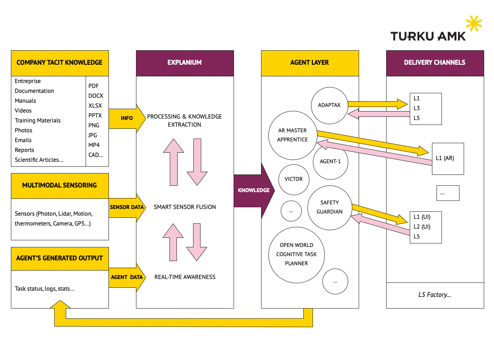

# EXPLAINIUM - Central Intelligence Hub
## Technical Architecture & Implementation Plan


*Building a "good life in a smart society" through excellence in applied AI science*

---

## 🎯 Executive Summary

**EXPLAINIUM** is the Central Intelligence Hub - the core brain of an AI-powered factory management system. EXPLAINIUM processes all data inputs and orchestrates an infinite network of specialized AI agents for industrial operations.

**Project Scope**: EXPLAINIUM integrates three critical input layers—company tacit knowledge, multimodal sensing, and agent outputs—to deliver real-time intelligence and decision-making capabilities for factory optimization.

### 🏆 Core Value Proposition
- **360° Factory Intelligence**: Complete visibility and understanding of all factory operations
- **Predictive Excellence**: Proactive maintenance, safety, and optimization
- **Adaptive Learning**: Continuous improvement through real-time feedback loops
- **Privacy-First Architecture**: Secure, on-premises deployment for industrial security
- **Infinite Scalability**: Unlimited AI agents tailored to specific factory needs

### 🎯 Key Objectives
- Transform traditional factories into intelligent, self-optimizing systems
- Reduce operational costs by 30-50% through predictive analytics
- Eliminate safety incidents through real-time monitoring and intervention
- Accelerate training and knowledge transfer for new employees
- Create digital twins of factory processes for optimization

---

## 🏗️ EXPLAINIUM System Architecture

### 🎯 High-Level Architecture Overview



*Complete system architecture showing EXPLAINIUM as the Central Intelligence Hub managing infinite AI agents*

### 📊 Three-Layer Input Architecture

#### 1️⃣ Enterprise Knowledge Base
**Purpose**: Transform institutional knowledge into actionable intelligence

- **Enterprise Documentation**: Manuals, procedures, policies, standards
- **Training Materials**: Videos, presentations, e-learning content
- **Historical Data**: Reports, incident logs, best practices, lessons learned
- **Multimedia Content**: Images, diagrams, technical drawings, schematics

#### 2️⃣ Multimodal Sensing Layer
**Purpose**: Real-time environmental and operational awareness

- **IoT Sensor Network**: Temperature, pressure, vibration, humidity, flow rates
- **Computer Vision**: Quality inspection, safety monitoring, workflow tracking
- **Machine Telemetry**: Equipment status, performance metrics, diagnostics
- **Environmental Monitoring**: Air quality, noise levels, energy consumption

#### 3️⃣ Agent Intelligence Layer
**Purpose**: Continuous learning and system optimization

- **Task Execution Logs**: Agent performance, decision traces, outcomes
- **Learning Feedback**: Model improvements, accuracy metrics, adaptations
- **Performance Analytics**: KPIs, efficiency measurements, optimization results
- **Collaborative Intelligence**: Inter-agent communication, knowledge sharing

---

## 🤖 Infinite AI Agent Network

### ♾️ Scalable Agent Architecture

EXPLAINIUM orchestrates an **infinite network of specialized AI agents** through a dynamic, scalable architecture that can spawn, manage, and coordinate unlimited agent instances based on factory requirements.

#### 🏗️ Agent Framework Architecture

```python
# Infinite Agent Orchestration System
class ExplainiumAgentOrchestrator:
    def __init__(self):
        self.agent_registry = {}
        self.agent_pool = AgentPool()
        self.task_queue = PriorityQueue()
        self.resource_manager = ResourceManager()

    def spawn_agent(self, agent_type, specialization=None):
        """Dynamically create new agent instances"""
        agent_id = self.generate_agent_id()
        agent = AgentFactory.create(agent_type, specialization)
        self.agent_registry[agent_id] = agent
        return agent_id

    def scale_agents(self, workload_metrics):
        """Auto-scale agent population based on demand"""
        for agent_type, demand in workload_metrics.items():
            if demand > self.get_capacity(agent_type):
                self.spawn_agent_cluster(agent_type, demand)

    def coordinate_infinite_agents(self, factory_state):
        """Coordinate unlimited number of agents"""
        active_agents = self.get_active_agents()
        for agent in active_agents:
            agent.process_factory_state(factory_state)
            agent.communicate_with_peers()
```

#### 🎯 Core Agent Categories

**Maintenance Agents**
- Predictive Maintenance Specialists
- Equipment Health Monitors
- Failure Prevention Agents
- Repair Coordination Agents

**Safety Agents**
- Real-time Safety Monitors
- PPE Compliance Checkers
- Hazard Detection Agents
- Emergency Response Coordinators

**Production Agents**
- Workflow Optimization Agents
- Quality Control Monitors
- Resource Allocation Planners
- Bottleneck Resolution Agents

**Knowledge Agents**
- Training Assistants
- Documentation Managers
- Skill Assessment Agents
- Knowledge Transfer Facilitators

#### 🔄 Dynamic Agent Spawning

```python
# Agent Factory for Infinite Scalability
class AgentFactory:
    @staticmethod
    def create(agent_type, specialization=None):
        base_config = AgentConfig.get_base(agent_type)
        if specialization:
            base_config.apply_specialization(specialization)

        return Agent(
            config=base_config,
            neural_network=NeuralNetworkFactory.create(agent_type),
            communication_layer=CommunicationLayer(),
            learning_module=ContinuousLearning()
        )

    @staticmethod
    def create_specialized_cluster(domain, task_complexity):
        """Create multiple specialized agents for complex tasks"""
        cluster = []
        for i in range(task_complexity.agent_count):
            agent = AgentFactory.create(
                agent_type=domain,
                specialization=task_complexity.specializations[i]
            )
            cluster.append(agent)
        return cluster
```

#### ♾️ Infinite Scalability Architecture

**EXPLAINIUM** is designed to support unlimited agent instances through:

- **Horizontal Scaling**: Automatic distribution across multiple compute nodes
- **Resource Pooling**: Shared memory and processing resources for efficiency
- **Load Balancing**: Intelligent task distribution based on agent capabilities
- **Auto-Scaling**: Dynamic agent population adjustment based on workload
- **Fault Tolerance**: Automatic agent recovery and task redistribution
- **Communication Mesh**: Efficient inter-agent messaging at any scale

---

## 🛠️ Technical Implementation Stack

### 🏗️ Core Technology Architecture

#### 🌐 Edge Computing Layer
- **MQTT Brokers**: Real-time device communication and messaging
- **Edge AI Processors**: Local inference for immediate decision-making
- **IoT Gateways**: Protocol translation and data aggregation

#### 📥 Data Ingestion Layer
- **Apache Kafka**: High-throughput stream processing and event sourcing
- **MinIO Object Storage**: Scalable storage for documents and media files
- **Redis Cache**: High-performance caching and session management

#### ⚙️ Processing Layer

**Document Processing Pipeline**:
```python
# Core Framework
FastAPI          # REST API and async processing
Celery + Redis   # Background task queue management
spaCy + Transformers  # NLP and language understanding
Local LLMs       # Llama 3/Mistral for content analysis
```

**ML/AI Processing Stack**:
```python
# Deep Learning & Computer Vision
PyTorch          # Deep learning framework
OpenCV           # Computer vision and video processing
Whisper          # Audio transcription and speech recognition
Detectron2       # Document layout analysis
```

**Agent Orchestration Framework**:
```python
# Multi-Agent Systems
LangChain        # Agent orchestration and tool integration
AutoGen          # Multi-agent collaborative systems
CrewAI           # Specialized agent coordination
```

#### 🗃️ Data Layer Architecture

**Multi-Database Strategy for Optimal Performance**:

```python
# Database Ecosystem
PostgreSQL       # Relational data and ACID compliance
ChromaDB         # Vector embeddings and semantic search
TimescaleDB      # Time-series sensor data analytics
Neo4j            # Knowledge graphs and relationship mapping
```

#### 💻 Application Layer

**User Interface Ecosystem**:
- **React Frontend**: Modern management dashboards with real-time updates
- **Streamlit**: Interactive analytics and data visualization interfaces
- **Gradio**: AI model interfaces for testing and demonstrations
- **Mobile Apps**: iOS/Android applications for field workers

#### 🏗️ Infrastructure Layer

**Container Orchestration & Deployment**:
```yaml
# Kubernetes Deployment
apiVersion: apps/v1
kind: Deployment
metadata:
  name: explainium-core
spec:
  replicas: 3
  selector:
    matchLabels:
      app: explainium
  template:
    spec:
      containers:
      - name: api-server
        image: explainium/api:latest
        ports:
        - containerPort: 8000
```

**Monitoring & Observability**:
- **Grafana**: Real-time monitoring and alerting dashboards
- **Prometheus**: Metrics collection and time-series monitoring
- **ELK Stack**: Centralized logging and log analysis
- **Jaeger**: Distributed tracing for microservices

---

## 📱 Interface Ecosystem - Delivery Channels

### 🎯 Multi-Modal User Interfaces

#### 💻 Management Command Center
- **Executive Dashboards**: High-level KPIs and strategic insights
- **Operational Dashboards**: Real-time factory floor monitoring
- **Analytics Workbench**: Deep-dive analysis and reporting tools

#### 🥽 Immersive AR/VR Interfaces
- **Training Simulations**: Safe, virtual environment for skill development
- **Maintenance Guidance**: AR overlays for equipment repair procedures
- **Process Visualization**: 3D factory models and workflow visualization

#### 🤖 Robotics Integration
- **Collaborative Robots (Cobots)**: Direct agent-to-robot communication
- **Autonomous Vehicles**: AGV coordination and path optimization
- **Robotic Process Automation**: Automated task execution and monitoring

#### 📱 Mobile Workforce Applications
- **Field Worker Apps**: Real-time task assignments and status updates
- **Safety Compliance**: Mobile safety checklists and incident reporting
- **Knowledge Access**: On-demand access to procedures and documentation

---

## 🚀 Implementation Roadmap & Development Plan

### 📋 Central Intelligence Hub Development Strategy

**Project Scope**: EXPLAINIUM focuses exclusively on building the **Central Intelligence Hub** - the core brain that manages all AI agents and data processing for factory optimization.

#### 🏗️ Phase 1: Foundation Layer
**Status**: 🔄 **IN PROGRESS** - PH-1 Implementation

- [x] Document ingestion and processing system
- [x] Basic text extraction (PDF, DOCX, TXT)
- [x] PostgreSQL database schema and API framework
- [x] Simple web interface for testing and validation
- [x] Image processing with OCR capabilities
- [x] Video frame extraction and storage

#### 🧠 Phase 2: Intelligence Layer
**Status**: 📋 **PLANNED**

- [ ] Local LLM integration (Llama 3/Mistral)
- [ ] Advanced NLP pipeline with entity recognition
- [ ] Vector embeddings and semantic search (ChromaDB)
- [ ] Knowledge graph construction (Neo4j)
- [ ] Multi-modal content understanding

#### 🤖 Phase 3: Agent Framework
**Status**: 📋 **PLANNED**

- [ ] Multi-agent orchestration system (LangChain/AutoGen)
- [ ] Specialized agent development (maintenance, safety, training)
- [ ] Real-time decision-making capabilities
- [ ] Agent communication and coordination protocols
- [ ] Performance monitoring and optimization

#### 🌐 Phase 4: Integration & Deployment
**Status**: 📋 **PLANNED**

- [ ] IoT sensor integration and edge computing
- [ ] Real-time data streaming (Apache Kafka)
- [ ] Production-ready deployment (Kubernetes)
- [ ] Security hardening and compliance
- [ ] Comprehensive testing and validation

#### 🚀 Phase 5: Advanced Features
**Status**: 📋 **FUTURE**

- [ ] AR/VR interface development
- [ ] Advanced predictive analytics
- [ ] Digital twin integration
- [ ] Industry-specific customizations
- [ ] Global scaling and optimization

---

## 🔧 Technology Considerations

### 💻 Hardware Requirements
```
Recommended Setup:
- CPU: 16+ cores (Intel Xeon/AMD EPYC)
- RAM: 64GB+ (for large document processing)
- GPU: NVIDIA RTX 4090 or Tesla V100 (for ML workloads)
- Storage: 10TB+ NVMe SSD (for document storage)
- Network: 10Gbps for large file transfers
```

### 📦 Software Dependencies
```dockerfile
# Core ML Framework
FROM nvidia/cuda:11.8-runtime-ubuntu20.04

# Python ML Stack
RUN pip install torch torchvision transformers
RUN pip install spacy sentence-transformers
RUN pip install opencv-python pillow
RUN pip install whisper-openai

# Document Processing
RUN pip install pypdf2 pdfplumber python-docx
RUN pip install pandas openpyxl

# API and Database
RUN pip install fastapi uvicorn celery
RUN pip install psycopg2 redis
```

---

## 🔗 Integration Architecture

### 🌐 API Design
```python
# RESTful API Endpoints
POST /api/v1/documents/upload
GET  /api/v1/documents/{id}/status
GET  /api/v1/documents/{id}/content
POST /api/v1/search/semantic
GET  /api/v1/knowledge-graph/{entity}
```

### 📡 Event-Driven Integration
```python
# Webhook notifications
{
    "event": "document_processed",
    "document_id": "uuid",
    "status": "completed",
    "extracted_entities": [...],
    "confidence_score": 0.95
}
```

---

## 📊 Technical Performance Monitoring

### ⚡ EXPLAINIUM Performance Metrics

#### 🧠 Central Intelligence Hub Metrics
- **Real-time Processing**: <100ms response time for critical decisions
- **Agent Coordination**: Unlimited concurrent agent management
- **Knowledge Processing**: 1000+ documents per hour processing capacity
- **System Availability**: 99.9% uptime with redundant failover systems

#### 🤖 Agent Network Performance
- **Agent Spawning**: <50ms new agent instantiation time
- **Inter-Agent Communication**: <10ms message passing latency
- **Load Balancing**: Dynamic agent distribution across resources
- **Scalability**: Linear performance scaling with agent count

#### 🎯 Intelligence Quality Metrics
- **Knowledge Extraction**: 95%+ accuracy in entity recognition
- **Decision Accuracy**: 98%+ correct agent task assignments
- **Learning Convergence**: Continuous improvement tracking
- **Multi-modal Integration**: Cross-reference validation scores

---

## 🛡️ Risk Management

### ⚠️ Technical Risk Mitigation
- **Model Accuracy**: Confidence scoring and human-in-the-loop validation
- **Performance**: Load balancing and auto-scaling mechanisms
- **Data Quality**: Input validation and error handling

### 📋 Business Risk Management
- **Privacy Compliance**: Regular security audits and compliance checks
- **Vendor Independence**: Open-source stack with containerized deployment
- **Scalability**: Modular architecture for incremental growth

---

*Developed following Turku UAS visual identity standards*
*© 2024 EXPLAINIUM Project - Building a good life in a smart society through excellence in applied AI science*
